

# UT1-A1 Documentación y sistema de control de versiones

**_Nombre:_** Nuhazet Correa Torres

**_Curso:_** 2º de Ciclo Superior de Desarrollo de Aplicaciones Web.

### ÍNDICE

- [Introducción](#id1)
- [Objetivos](#id2)
- [Material empleado](#id3)
- [Desarrollo](#id4)
- [Conclusiones](#id5)

#### **_Introducción_**. 

- En esta primera práctica del año, vamos a poner en práctica todos los conceptos teóricos que hemos aprendido sobre el control de versiones. Lo haremos en parejas y a través de GitHub, donde simularemos algunas situaciones reales y problemas que se pueden dar a la hora de trabajar en esta plataforma. A pesar de ser una práctica en parejas, simularemos situaciones que se pueden dar en grupos de trabajo grandes o en proyectos del tipo "Open source". Tocaremos aspectos relacionados con las ramas, hacer un fork a repositorios, abrir y gestionar un pull request y también generaremos intencionadamente un conflicto para saber solucionarlo mezclando (merge) como se nos pide en la actividad.

- Además, la importancia de relizar esta práctica es importante puesto que Git es actualmente el sistema de control de veriones más popular en el ámbito laboral y que la mayoria de empresas incorporan en sus grupos de trabajo.

#### **_Objetivos_**. 

- Respecto a la parte de control de versiones, los objetivos son afianzar los contenidos teóricos con una práctica para saber como trabajar en un futuro en proyectos más grandes, donde el control de versiones se hace muy importante y el único método eficaz en el mundo del desarrollo para que el trabajo en equipo funcione, como así hemos visto en clase en la parte teórica.
- Respecto a la parte de documentación, además de las charlas que se tienen en los pull request de la actividad, deberemos etiquetar al final el software y, junto a todo ello, este informe está siendo realizado en markdown, por lo que estamos viendo y aprendiendo distintas formas de realizar la documentación de proyectos.

#### **_Material empleado_**. 

Al tratarse de una práctica sobre el control de versiones y la documentación de proyectos el único material que se ha empleado para la práctica es la plataforma de GitHub para las actividades que se solicitaban.

#### **_Desarrollo_**.   

**User1 : Adrián Herrera**  
**User2 : Nuhazet Correa**

1. En primer lugar, hemos tenido que asignarnos los roles de "User1" y "User2", en este caso yo he sido el usuario 1 y mi compañero, Nuhazet, ha sido el usuario 2. Lo primero que he relizado ha sido la creación del repositorio "original" al que le he añadido el fichero Readme.md junto a la licencia de tipo MIT y además lo he hecho público, todo ello de forma muy sencilla, ya que la interfaz de creación de un repositorio en github permite hacerlo de forma automática seleccionando lo que queramos. Una vez hecho, he añadido los archivos que se adjuntaban con la práctica en local y he subido los cambios.

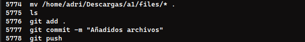

2. Para trabajar como usuario 2, se tiene que empezar haciendo un fork del proyecto, clonando dicho fork a local.

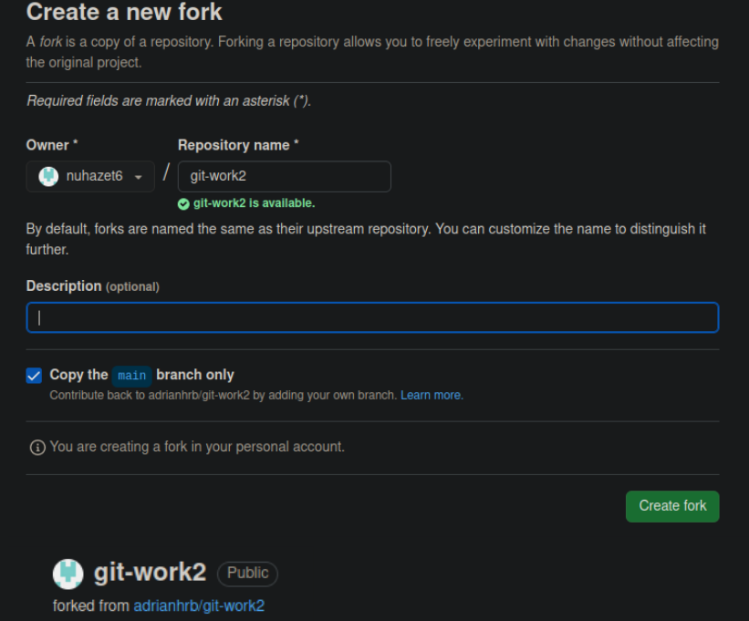
 
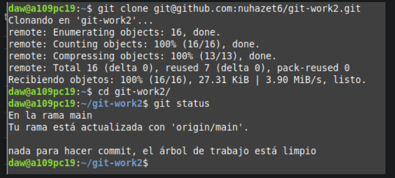

3. Una vez el usuario 2 ha realizado su parte, he abierto un issue en github que se referenció con el número #1 y que hace alusión a los cambios que hay que realizar en el archivo index.html.

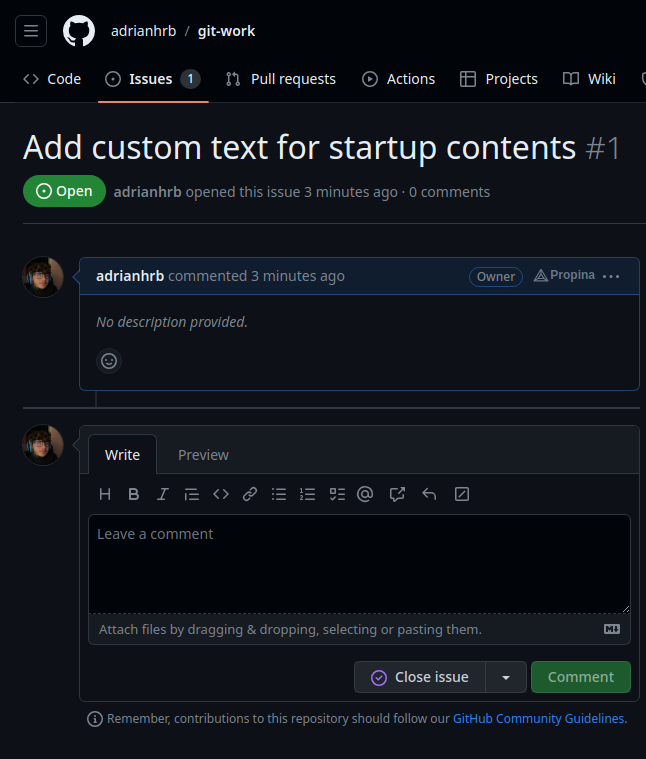

4. Se crea una rama nueva para trabajar sin afectar a la rama principal y se hacen cambios en el proyecto haciendo un PR al usuario 1.

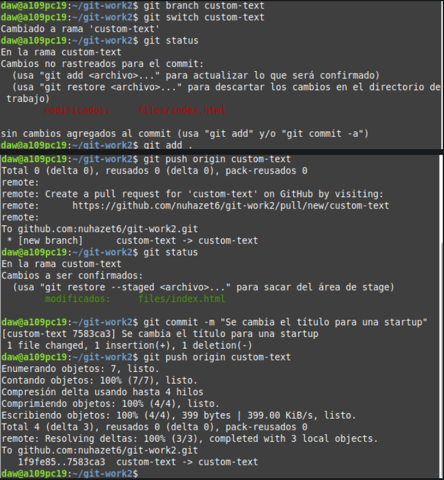
 

5. Cuando el usuario 2 ha realizado su parte, es hora de añadir un remoto que apunte al fork de nuestro repositorio original para poder ver y manejar los cambios que se han realizado, y una vez añadida la rama vamos a actualizar los cambios que se hayan hecho en ese fork. Seguiremos los pasos de la imágen:

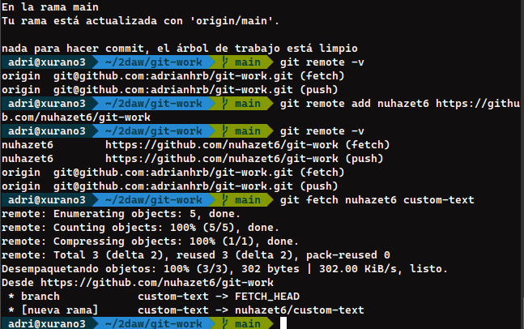

6. Con la rama remota (que apunta al repo del usuario2) ya en nuestro local, podemos comprobar los cambios que dicho usuario ha hecho e incluso podemos nosotros añadir más contenido o mejoras que creamos convenientes. Además, como se trata de una rama remota todos los commits que hagamos se van a subir directamente al pull request donde ambos usuarios podremos ver, leer e interactuar para llegar a un acuerdo. Para que todo funcione, cuando queramso subir los cambios deberemos hacer el push indicando el nombre del usuario que ha hecho el fork y el nombre de la rama en la que ha trabajado como vemos en la siguiente imágen [antes de hacer el push, he hecho unos cambios extra en el index.html(usuario1)]
:

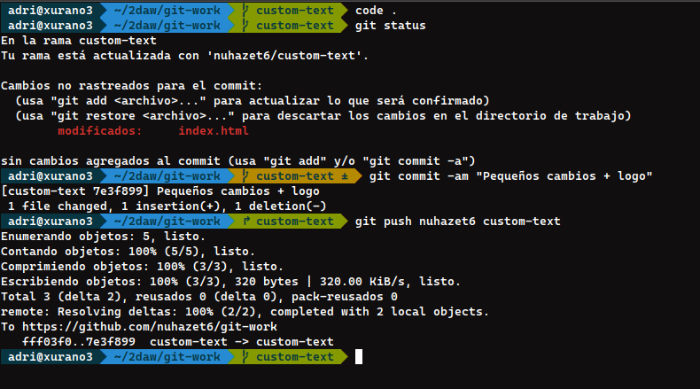

7. El usuario 2 actualiza su repositorio local con los cambios realizados por el usuario 1 y añade un cambio más.

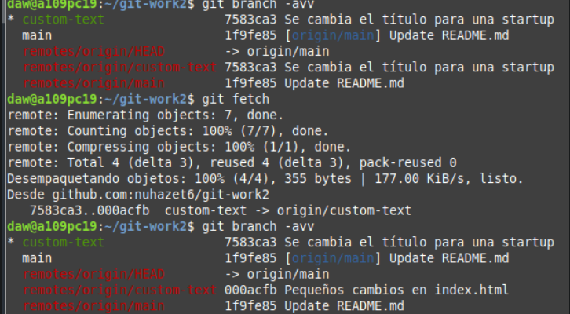
 
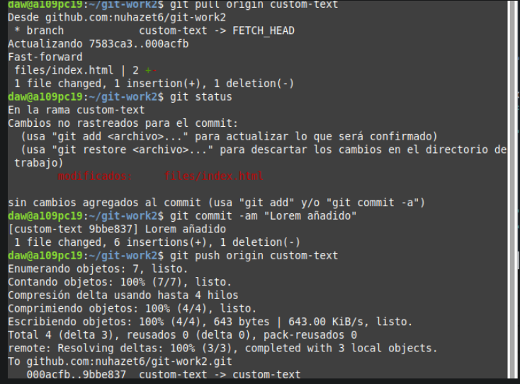

8. Con los cambios finales confirmados, es hora de actualizar nuestra rama main con los cambios realizados en esa rama remota. Para ello, yo como usuario 1 puedo hacerlo de una forma sencilla. Debo colocarme en la rama main y hacer un git pull, y con ello ya tendría todos los cambios que hemos acordado en la rama main. Una vez hecho esto, toca cerrar el pull request y cerrar la tarea con un comentario.

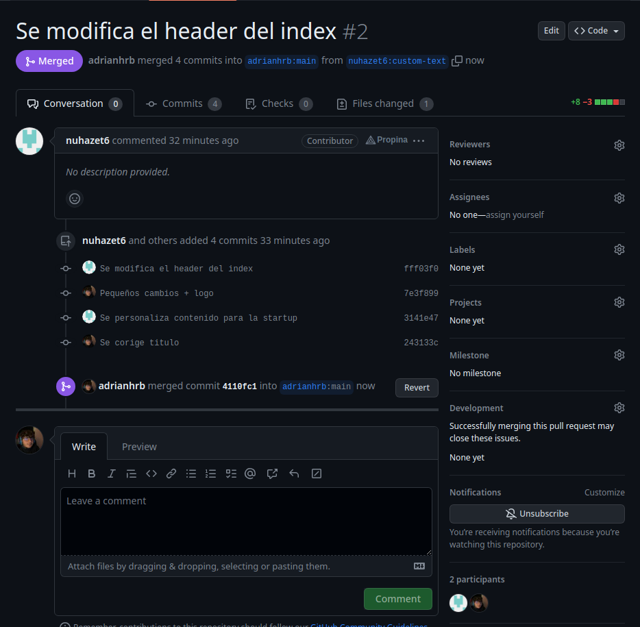

9. Se añade la rama remota apuntando al repositorio del usuario 1 y se actualiza el main local con el main de dicho repositorio. Finalmente se usa git push para actualizar el repositorio remoto del usuario 2.

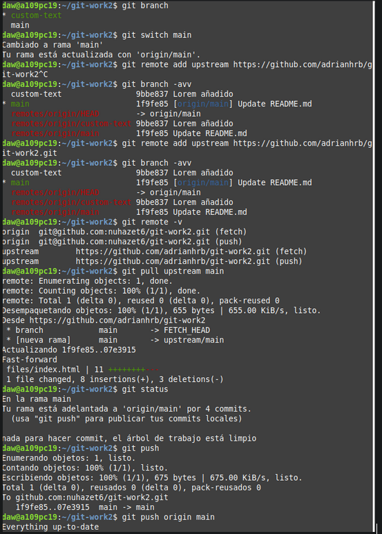

10. Ahora, vamos a pasar a la parte en la que simularemos o "forzaremos" un conflicto intencionadamente para solucionarlo. Para ello, yo como user1 haré un cambio en un archivo y le haré git add + git commit pero no los subiré al remoto para forzar ese conflicto.

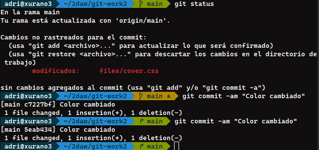

11. Por parte del usuario 2 se crea una rama nueva y se realizan cambios sobre la misma.

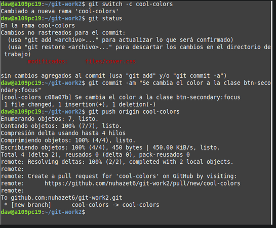

12. Ahora, con los cambios de user2 me toca traer los cambios a mi local. Me saltará un error porque hay en el mismo archivo, la misma cosa modificada. Ahora, para solucionar el conflicto iremos a dicho archivo y nos quedaremos con los cambios que ha hecho el user2.

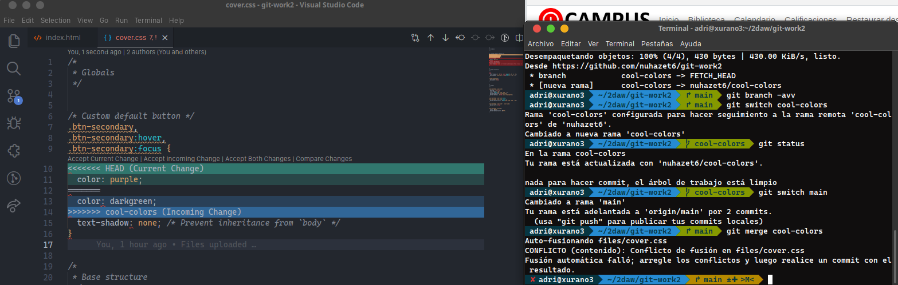

13. Después de arreglar el conflicto, haremos un commit especificando lo que hemos hecho y nos traeremos los cambios de esa rama a la main y le crearemos una tag al repo para tenerlo identificado.

- No hemos encontrado ninguna dificultad a destacar. Si que hemos tenido algunos problemas a la hora de subir los cambios a la rama main pero han sido por errores que hemos cometido y los hemos conseguido resolver volviendo hacia atrás viendo los pasos que habiamos seguido y dandonos cuenta de esos errores.

#### **_Conclusiones_**. 

User 2: De esta tarea podemos aprender como manejar git a nivel general. Como idea para mejorar aún más la práctica se podría añadir más contenido al usuario 2 ya que realiza menos comandos. También se podría en algún punto de la práctica cambiar los roles haciendo que el usuario 2 crease un repositorio y así trabajar las dos partes por igual.

User 1: La tarea ha sido de gran ayuda para manjear github de una manera más "real" y como se realiza tipicamente en el mundo laboral.

