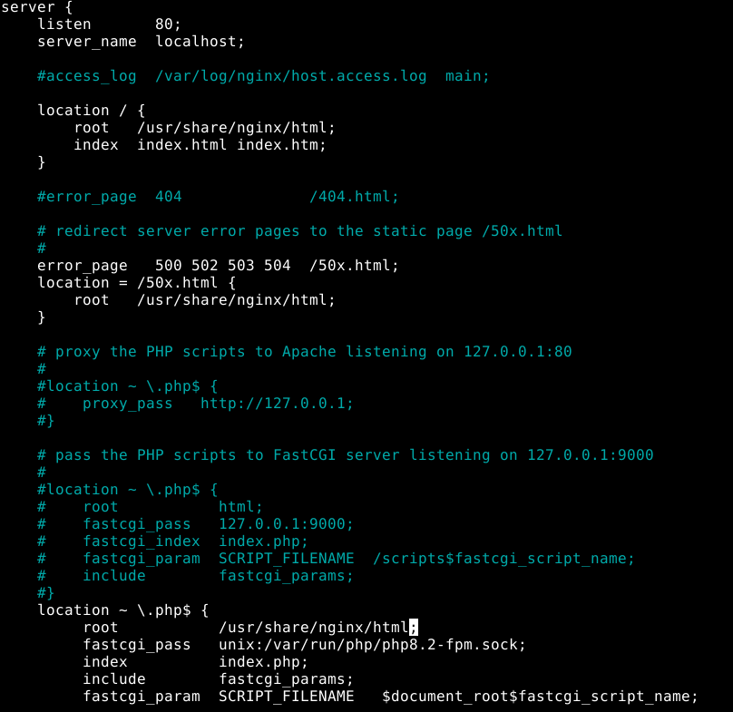
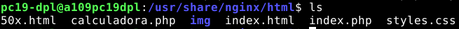
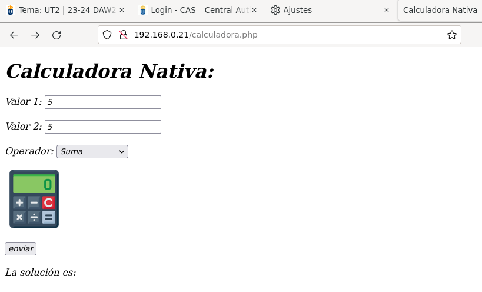
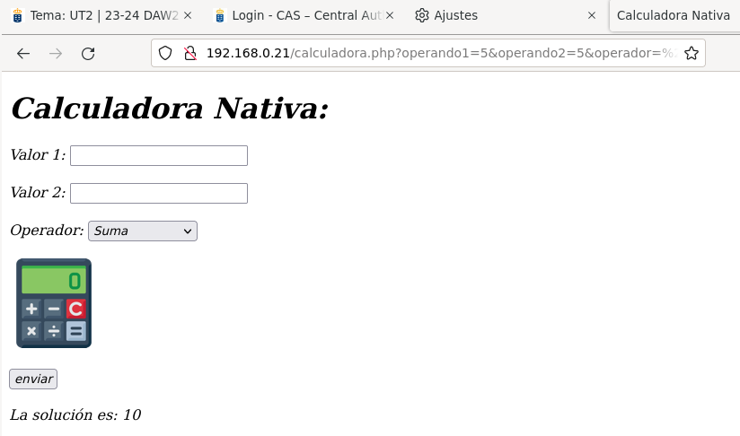
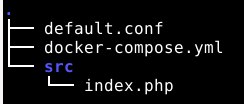
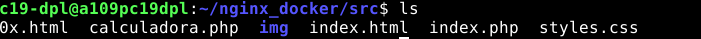
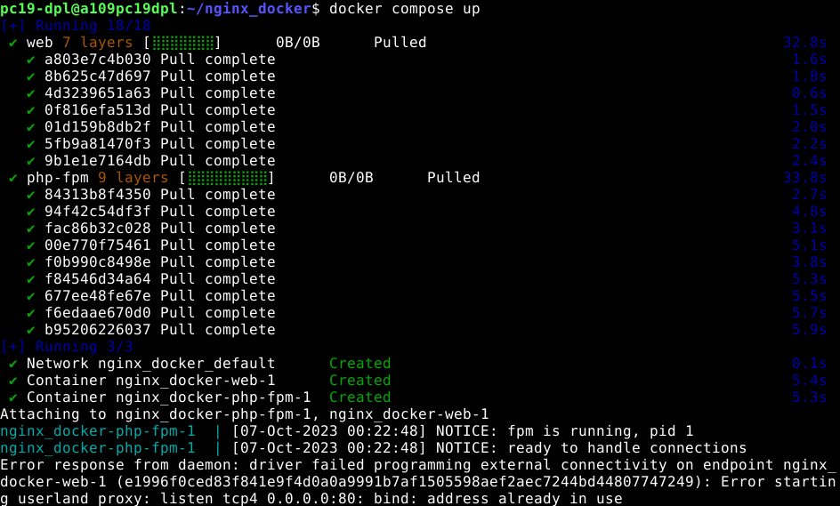
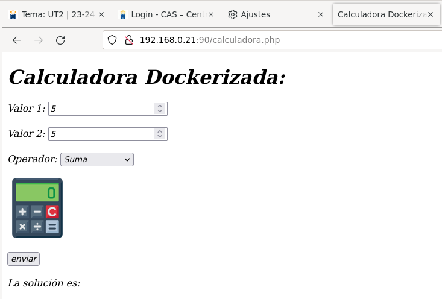
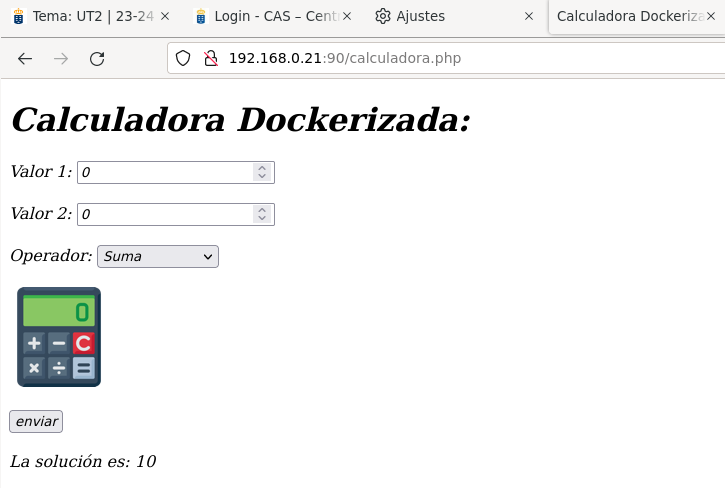

<center>

# UT2-A1: Implantación de arquitecturas web


</center>

***Nombre:*** Nuhazet Correa Torres
***Curso:*** 2º de Ciclo Superior de Desarrollo de Aplicaciones Web.

### ÍNDICE

+ [Introducción](#id1)
+ [Objetivos](#id2)
+ [Material empleado](#id3)
+ [Desarrollo](#id4)
+ [Conclusiones](#id5)


#### ***Introducción***. <a name="id1"></a>

La práctica consiste en el despliegue de una aplicación php con nginx de forma nativa y dockerizada

#### ***Objetivos***. <a name="id2"></a>

Hacer fichero con calculadora en php y su respectivo html
Desplegar el fichero con nginx nativo
Desplegar el fichero con nginx y docker

#### ***Material empleado***. <a name="id3"></a>

máquina virtual del cliente y máquina virtual del servidor
Los diversos programas instalados y sus respectivas configuraciones (PHP-FPM, nginx, docker)

#### ***Desarrollo***. <a name="id4"></a>
##### Ficheros a desplegar:
```
<!DOCTYPE html>
<html lang="es">

<head>
    <meta charset="UTF-8" />
    <meta http-equiv="X-UA-Compatible" content="IE=edge" />
    <meta name="viewport" content="width=device-width, initial-scale=1.0" />
    <link rel="stylesheet" href="styles.css">
    <title>Calculadora</title>
</head>

<body>
    <h1>Calculadora:</h1>
    <div>
        <form method="post" action="calculadora.php">
            Valor 1: <input type="text" name="operando1" value = "0">
            <br>
            <br>
            Valor 2: <input type="text" name="operando2" value = "0">
            <br>
            <br>
            Operador: <select name="operador">
                <option value="+">Suma
                </option>
                <option value="-">Resta
                </option>
                <option value="*">Multiplicación
                </option>
                <option value="/">División
                </option>
            </select>
            <br>
            <br>
            
            <br>
            <br>
            <input type="submit" value="enviar">
        </form>
    </div>
</body>


</html>
<?php
    error_reporting(0)
    $operador = $_POST['operador'];
    $a=$_POST['operando1'];
    $b=$_POST['operando2'];
    $resultado = eval("return ".$a.$operador.$b." ;");
    echo nl2br("\nLa solución es: ".$resultado);
    ?>
```
css:
```
*{
  font-style:italic;
}
```
##### Nginx nativo
Debemos comprobar que ruta tenemos en el archivo .conf dentro de /etc/nginx/conf.d/, en este caso vamos a usar el default.conf está así:



La ruta tiene estos ficheros:



Al abrir la página en la máquina cliente se vería así:




##### Nginx + Docker
Primero tenemos que movernos donde queramos levantar los servicios y seguir una estructura de ficheros/directorios como la siguiente:



En el default.conf pondremos lo siguiente:
```
server {
  server_name _;
  index index.php index.html;

  location ~ \.php$ {
    fastcgi_pass php-fpm:9000;
    include fastcgi_params;  # fichero incluido en la instalación
    fastcgi_param SCRIPT_FILENAME $document_root$fastcgi_script_name;
  }
}
```

En el docker-compose.yml lo siguiente:
```
version: "3.3"

services:
  web:
    image: nginx
    volumes:
      - ./src:/etc/nginx/html # "root" por defecto en Nginx
      - ./default.conf:/etc/nginx/conf.d/default.conf
    ports:
      - 90:80

  php-fpm:
    image: php:8-fpm
    volumes:
      - ./src:/etc/nginx/html
```
Pasamos los archivos al src(los esenciales son calculadora.php, styles y la carpeta img con calculadora.png dentro):



Levantamos los servicios:



Abrimos la página con el cliente:




#### ***Conclusiones***. <a name="id5"></a>

Como conclusión la forma dockerizada es mucho más adaptable que la nativa pudiendo desplegar en cualquier ruta.
