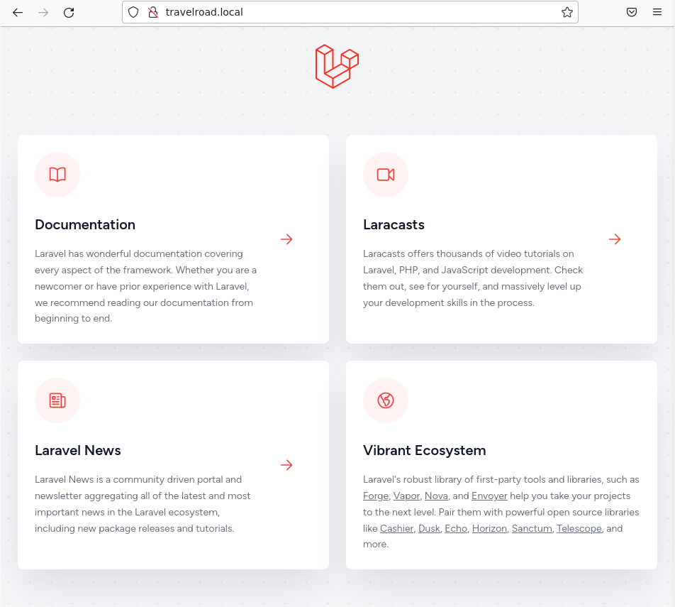

<center>

# UT4-A1: Implantación de arquitecturas web


</center>

***Nombre:*** Nuhazet Correa Torres
***Curso:*** 2º de Ciclo Superior de Desarrollo de Aplicaciones Web.

### ÍNDICE

+ [Introducción](#id1)
+ [Objetivos](#id2)
+ [Material empleado](#id3)
+ [Desarrollo](#id4)
+ [Conclusiones](#id5)


#### ***Introducción***. <a name="id1"></a>

Práctica sobre el despliegue de una aplicación con PostgreSQL y Laravel

#### ***Objetivos***. <a name="id2"></a>

Instalar y configurar PostgreSQL y pgAdmin, desarrollar una aplicación para mostrar los datos y crear un script que actualice la máquina de producción con los cambios realizados en desarrollo

#### ***Material empleado***. <a name="id3"></a>

- Nginx
- [Datos empleados](https://github.com/sdelquin/dpl/blob/main/ut4/files/places.csv)
- Python
- Instalación y configuración PHP+nginx

#### ***Desarrollo***. <a name="id4"></a>
*** Aclaración: Los pasos de instalación son comunes para la máquina de desarrollo y producción ***
##### Instalación PostgreSQL


###### Configuración
Primero iniciamos el cliente psql con el usuario habilitado por defecto para acceder a la administración de la base de datos:  

  

Con el usuario predeterminado creamos un usuario específico para asignarlo únicamente a una base de datos y salimos del cliente psql para volver a iniciar sesión más adelante con el usuario en cuestión:  

  

Iniciamos sesión con el usuario travelroad_user Y creamos una tabla donde pondremos los datos:  

  

###### Carga de Datos
Descargamos los datos, los copiamos con copy a la base de datos y comprobamos ls datos entrando y usando SELECT:  

  

###### pgAdmin
###### Dependencias  
Aseguramos que la ruta a los binarios de las herramientas ejecutables en línea de comandos que instala Python está en el PATH e instalamos Python:  

  

[Instalación Python](https://github.com/sdelquin/edubase/blob/main/docs/python-install-linux.md)  

  

###### Instalación
Creamos las carpetas de trabajo con los permisos adecuados, creamos un entorno virtual de Python (lo activamos) e instalamos el paquete pgadmin4:  

  

Ahora lanzamos el script de configuración en el que tendremos que dar credenciales para una cuenta "master", en caso de dar error instalar setuptools ``` pip install setuptools ``` :  

  

Para poder lanzar el servidor pgAdmin en modo producción y con garantías, necesitaremos hacer uso de un procesador de peticiones WSGI denominado gunicorn:  


Levantamos el servidor pgAdmin utilizando gunicorn:

  

###### Virtualhost en Nginx
Creamos el virtual host en nginx ``` sudo nano /etc/nginx/conf.d/pgadmin.conf ``` con el siguiente contenido:

  

####### Demonizar el servicio
Creamos un servicio del sistema ``` sudo nano /etc/systemd/system/pgadmin.service ``` con el siguiente contenido:

  

Recargamos los servicios para luego levantar pgAdmin y habilitarlo en caso de reinicio del sistema, por último comprobamos que el servicio está funcionando correctamente:

  

Accedemos a pgadmin y registramos un servidor con el nombre TravelRoad

  

  

###### Acceso externo
Añadimos en el archivo ``` sudo nano /etc/postgresql/16/main/postgresql.conf ``` lo siguiente en la línea 64:  

  

Y añadimos al final del archivo ``` sudo nano /etc/postgresql/16/main/pg_hba.conf ``` lo siguiente:  

  

Reiniciamos el servicio de Postgre y comprobamos que el servicio ya está escuchando en todas las IPs, si no tenemos instalado netstat tendremos que instalarlo con ``` sudo netstat -napt | grep postgres | grep -v tcp6 ```:  

  

##### Laravel
###### Instalación  
###### Composer

Instalamos Composer (se necesita PHP ``` sudo apt install php ```) y comprobamos version:  

  

Instalamos ciertos módulos con: ``` sudo apt install -y php8.2-mbstring php8.2-xml \
php8.2-bcmath php8.2-curl php8.2-pgsql ```  
Creamos el proyecto: ```composer create-project laravel/laravel travelroad ``` (necesita zip y 7zip ``` sudo apt install zip 7zip ``` )  
Cambiamos el .env:  

  

###### Configuración Nginx
Configuramos permisos para ciertas carpetas y el host de nginx para nuestra aplicación:  
```
sudo chgrp -R nginx storage bootstrap/cache
sudo chmod -R ug+rwx storage bootstrap/cache
sudo nano /etc/nginx/conf.d/travelroad.conf
```

  

Recargamos nginx y accedemos a la página:

  

##### Lógica de negocio
Creamos la aplicación con la siguiente ruta:

  

y con el siguiente contenido:  
```
<?php

// https://laravel.com/api/6.x/Illuminate/Support/Facades/DB.html
use Illuminate\Support\Facades\DB;

Route::get('/', function () {
  $wished = DB::select('select * from places where visited = false');
  $visited = DB::select('select * from places where visited = true');

  return view('travelroad', ['wished' => $wished, 'visited' => $visited]);
});
 ```
Subimos el repositorio y lo bajamos en la máquina de producción (hay que ejecutar ``` composer install ``` para crear la carpeta vendor/ e instalar todas las dependencias necesarias), una vez hecho esto vamos a crear un script que se conecte por ssh a la maquina de desarrollo, haga un push del repositorio y haga el pull en producción para mantener los dos repositorios actualizados:
(suponemos que las rutas de las aplicaciones son las mismas)
```
#!/bin/bash
path=$(readlink -e $0)
ssh nuhazet@nuhazet.arkania.es "
  cd $(dirname $path)
  git pull
  composer install
"
```
Ahora simplemente ejecutamos el script y accedemos a la versión en producción:  

  

Por último para hacer la redirección creamos un .conf con el siguiente contenido:  
```
server {
    listen 80;
    server_name www.laravel.travelroad.nuhazet.arkania.es;
    return 301 https://laravel.travelroad.nuhazet.arkania.es$request_uri;
}
```  
y generamos un certificado con el dominio www:  
```
sudo certbot --nginx -d www.laravel.travelroad.nuhazet.arkania.es
```  
#### ***Conclusiones***. <a name="id5"></a>
La práctica es bastante útil para aprender y coger agilidad desplegando una aplicación.
