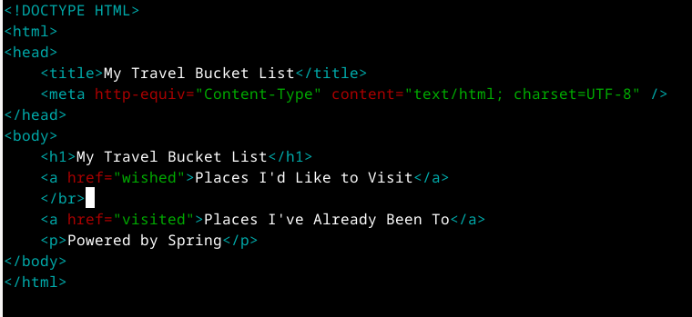

# ÍNDICE

+ [Material empleado](#id1)
+ [Desarrollo](#id2)

# ***Material empleado***. <a name="id1"></a>

- Nginx
- PostgreSQL + datos
- pgAdmin
- CertBot

## ***Desarrollo***. <a name="id2"></a>
### Instalación
```
curl -O --output-dir /tmp \
https://download.java.net/java/GA/jdk19.0.1/afdd2e245b014143b62ccb916125e3ce/10/GPL/openjdk-19.0.1_linux-x64_bin.tar.gz
```  

```
sudo tar -xzvf /tmp/openjdk-19.0.1_linux-x64_bin.tar.gz \
--one-top-level=/usr/lib/jvm
```  

extablecemos la variables de entorno:  
``` 
sudo nano /etc/profile.d/jdk_home.sh
```  

Contenido:  
``` #!/bin/sh
export JAVA_HOME=/usr/lib/jvm/jdk-19.0.1/
export PATH=$JAVA_HOME/bin:$PATH
```  

```
sudo update-alternatives --install \
"/usr/bin/java" "java" "/usr/lib/jvm/jdk-19.0.1/bin/java" 0
```  

```
sudo update-alternatives --install \
"/usr/bin/javac" "javac" "/usr/lib/jvm/jdk-19.0.1/bin/javac" 0
```

```
sudo update-alternatives --set java \
/usr/lib/jvm/jdk-19.0.1/bin/java
```  

```
sudo update-alternatives --set javac \
/usr/lib/jvm/jdk-19.0.1/bin/javac
```  

``` 
sudo apt install -y zip
```  

``` 
curl -s https://get.sdkman.io | bash
```  

``` 
source "$HOME/.sdkman/bin/sdkman-init.sh"
```  

``` 
sdk install springboot
```  

``` 
sdk install maven
```  

### Aplicación
```
spring init \
--build=maven \
--dependencies=web \
--group=edu.dpl \
--name=travelroad_spring \
--description=TravelRoad_Spring \
travelroad_spring
```

dentro de travel_spring:
``` 
mkdir -p src/main/java/edu/dpl/travelroad_spring/controllers
```  
``` 
touch src/main/java/edu/dpl/travelroad_spring/controllers/HomeController.java
```  
``` 
mkdir -p src/main/java/edu/dpl/travelroad_spring/models
```  
```  
touch src/main/java/edu/dpl/travelroad_spring/models/Place.java
```  
``` 
mkdir -p src/main/java/edu/dpl/travelroad_spring/repositories
```  
``` 
touch src/main/java/edu/dpl/travelroad_spring/repositories/PlaceRepository.java
```  
``` 
touch src/main/resources/templates/home.html
```  
Modificamos el controlador:
``` 
nano src/main/java/edu/dpl/travelroad_spring/controllers/HomeController.java
```
Contenido:  
```
package edu.dpl.travelroad_spring.controllers;

import edu.dpl.travelroad_spring.models.Place;
import edu.dpl.travelroad_spring.repositories.PlaceRepository;
import org.springframework.beans.factory.annotation.Autowired;
import org.springframework.stereotype.Controller;
import org.springframework.ui.Model;
import org.springframework.web.bind.annotation.GetMapping;

@Controller
public class HomeController {
    private final PlaceRepository placeRepository;

    @Autowired
    public HomeController(PlaceRepository placeRepository) {
        this.placeRepository = placeRepository;
    }

    @GetMapping("/")
    public String home(Model model) {
        return "home";  // home.html
    }
    @GetMapping("/wished")
    public String wished(Model model) {
        model.addAttribute("wished", placeRepository.findByVisited(false));
        return "wished";  // wished.html
    }
    @GetMapping("/visited")
    public String visited(Model model) {
        model.addAttribute("visited", placeRepository.findByVisited(true));
        return "visited";  // visited.html
    }
}
```  
Modelos:  
```
nano src/main/java/edu/dpl/travelroad_spring/models/Place.java
```  
```
package edu.dpl.travelroad_spring.models;

import javax.persistence.Entity;
import javax.persistence.GeneratedValue;
import javax.persistence.GenerationType;
import javax.persistence.Id;
import javax.persistence.Table;

@Entity
@Table(name = "places")
public class Place {

    @Id
    @GeneratedValue(strategy = GenerationType.AUTO)
    private Long id;

    private String name;
    private Boolean visited;

    public Place() {
    }

    public Place(Long id, String name, Boolean visited) {

        this.id = id;
        this.name = name;
        this.visited = visited;
    }

    public Long getId() {
        return id;
    }

    public String getName() {
        return name;
    }

    public void setName(String name) {
        this.name = name;
    }

    public Boolean getVisited() {
        return visited;
    }

    public void setVisited(Boolean visited) {
        this.visited = visited;
    }
}
```
Repositorio
```
nano src/main/java/edu/dpl/travelroad_spring/repositories/PlaceRepository.java
```
Contenido:  
```
package edu.dpl.travelroad_spring.repositories;

import edu.dpl.travelroad_spring.models.Place;

import java.util.List;
import org.springframework.data.repository.CrudRepository;
import org.springframework.stereotype.Repository;
import org.springframework.data.jpa.repository.Query;

@Repository
public interface PlaceRepository extends CrudRepository<Place, Long> {

    @Query("SELECT p FROM Place p WHERE p.visited = ?1")
    List<Place> findByVisited(Boolean visited);
}
```  
Plantillas:  
```
nano src/main/resources/templates/home.html
```  
Contenido:  
  
```
nano src/main/resources/templates/wished.html
```  
Contenido:  
  
```
nano src/main/resources/templates/visited.html
```  
Contenido:  
  
Dependencias
``` 
nano pom.xml
```  
Contenido:  
```
<?xml version="1.0" encoding="UTF-8"?>
<project xmlns="http://maven.apache.org/POM/4.0.0" xmlns:xsi="http://www.w3.org/2001/XMLSchema-instance"
	xsi:schemaLocation="http://maven.apache.org/POM/4.0.0 https://maven.apache.org/xsd/maven-4.0.0.xsd">
	<modelVersion>4.0.0</modelVersion>
	<parent>
		<groupId>org.springframework.boot</groupId>
		<artifactId>spring-boot-starter-parent</artifactId>
		<version>2.7.5</version>
		<relativePath/> <!-- lookup parent from repository -->
	</parent>
	<groupId>edu.dpl</groupId>
	<artifactId>travelroad_spring</artifactId>
	<version>0.0.1-SNAPSHOT</version>
	<name>travelroad_spring</name>
	<description>travelroad_spring</description>
	<properties>
		<java.version>19</java.version>
	</properties>
	<dependencies>
		<dependency>
			<groupId>org.springframework.boot</groupId>
			<artifactId>spring-boot-starter-web</artifactId>
		</dependency>

		<dependency>
			<groupId>org.springframework.boot</groupId>
			<artifactId>spring-boot-starter-test</artifactId>
			<scope>test</scope>
		</dependency>

		<dependency>
			<groupId>org.springframework.boot</groupId>
			<artifactId>spring-boot-starter-thymeleaf</artifactId>
		</dependency>

        <dependency>
			<groupId>org.springframework.boot</groupId>
			<artifactId>spring-boot-starter-data-jpa</artifactId>
		</dependency>

        <dependency>
          <groupId>org.postgresql</groupId>
          <artifactId>postgresql</artifactId>
          <scope>runtime</scope>
        </dependency>
	</dependencies>

	<build>
		<plugins>
			<plugin>
				<groupId>org.springframework.boot</groupId>
				<artifactId>spring-boot-maven-plugin</artifactId>
			</plugin>
		</plugins>
	</build>

</project>
 ```
Credenciales  
``` 
nano src/main/resources/application.properties
```  
Contenido:  
``` 
spring.datasource.url=jdbc:postgresql://localhost:5432/travelroad
spring.datasource.username=travelroad_user
spring.datasource.password=dpl10000
```  
```
./mvnw compile  
```  
```
./mvnw package
```  
``` 
nano run.sh
```  
Contenido:  
``` 
#!/bin/bash

cd $(dirname $0)

./mvnw package  # el empaquetado ya incluye la compilación

# ↓ Último fichero JAR generado
JAR=`ls target/*.jar -t | head -1`
/usr/bin/java -jar $JAR
```  
``` 
chmod +x run.sh
```
``` 
mkdir -p ~/.config/systemd/user
nano ~/.config/systemd/user/travelroad_spring.service
```  
Contenido:  
``` 
[Unit]
Description=Spring Boot TravelRoad

[Service]
Type=simple
StandardOutput=journal
ExecStart=/home/pc19-dpl/travelroad_spring/run.sh

[Install]
WantedBy=default.target
```  
``` 
systemctl --user enable travelroad_spring.service
```  
``` 
systemctl --user start travelroad_spring.service
```  
Configuración Nginx:  
``` 
sudo nano /etc/nginx/conf.d/travelroad_spring.conf
```  
``` 
server {
    server_name spring.local;

    location / {
        proxy_pass http://localhost:8080;  # socket TCP
    }
}
```  
``` 
sudo systemctl reload nginx
```  
Creamos el script para despliegue:  
``` 
nano deploy.sh
```  
Contenido:  
```
#!/bin/bash

ssh nuhazet@nuhazet.arkania.es "
  cd travelroad_spring
  git pull
  systemctl --user restart travelroad_spring.service
  
"
```  
```
chmod +x deploy.sh
```  
Ahora, debemos  descargar el repositorio en la máquina de producción y repetir todos los pasos necesarios (instalación, creación del servicio(tener en cuenta de cambiarle la ruta), etc), una vez hecho esto ejecutamos el script deploy en la máquina de desarrollo, acto seguido configuramos el .conf de la máquina de producción:  
```
server {
    server_name spring.nuhazet.arkania.es;

    location / {
        proxy_pass http://localhost:8080;  # socket TCP
    }
}
```  
Creamos los certificados:  
```
sudo certbot --nginx
```  
Hacemos la redirección www:  
```
server {
    listen 80;
    server_name www.spring.nuhazet.arkania.es;
    return 301 https://spring.nuhazet.arkania.es$request_uri;
}
```  
Instalamos el certificado del www:  
```
sudo certbot --nginx
```
Resultado:  
  
  
